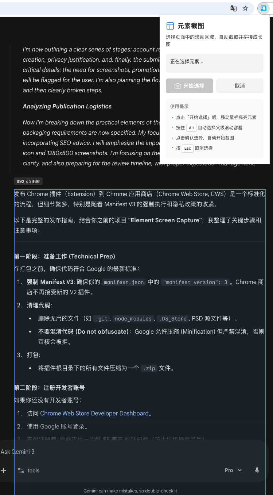

# Element Screen Capture

一个专注于解决「网页局部滚动截图」痛点的 Chrome 扩展。

选取页面中任意滚动区域（如聊天框、代码块、侧边栏），自动滚动并拼接成一张完整长图，同时智能隔离页面上的悬浮干扰元素。



## 功能特性

- **智能元素拾取** - 鼠标悬停高亮，按住 `Alt` 自动选中父级滚动容器
- **干扰隔离模式** - 自动隐藏 `position: fixed/sticky` 的遮挡元素（导航栏、输入框等），截图后无感恢复
- **原生级截图质量** - 使用 Chrome 原生 `captureVisibleTab` API，非 html2canvas 渲染
- **智能拼接** - 自动检测重复像素行，处理 sticky header 重复问题
- **滚动条隐藏** - 截图时自动隐藏滚动条，输出干净

## 安装

### 从源码安装

1. 克隆仓库
```bash
git clone https://github.com/makecoderai/element-screen-capture.git
```

2. 打开 Chrome，访问 `chrome://extensions/`

3. 开启右上角「开发者模式」

4. 点击「加载已解压的扩展程序」，选择项目目录

## 使用方法

1. 点击浏览器工具栏中的扩展图标
2. 点击「开始选择」按钮
3. 移动鼠标到目标区域，元素会高亮显示
   - 蓝色边框：普通元素
   - 绿色边框：可滚动容器
4. 按住 `Alt` 键可自动选择父级滚动容器
5. 点击确认选择，自动开始截图
6. 截图完成后自动下载 PNG 文件

**快捷键**
- `Alt` - 选择父级滚动容器
- `Esc` - 取消选择

## 技术架构

```
element-screen-capture/
├── manifest.json           # Chrome MV3 配置
├── background.js           # Service Worker（截图、拼接、下载）
├── content/
│   └── content.js          # 内容脚本（元素选择、隔离、滚动控制）
├── popup/                  # 弹出界面
└── icons/                  # 扩展图标
```

**核心模块**
- `Inspector` - 元素拾取与高亮
- `Isolator` - 干扰元素隔离与恢复
- `Scroller` - 滚动控制与帧捕获
- `Stitcher` - OffscreenCanvas 图片拼接

## 开发

本项目由 [makeCoder](https://makecoder.com) 的 Coder 智能体完成开发。

### 使用 Coder 继续开发

```bash
# 安装
npm install -g makecoder

# 在项目目录启动
cd element-screen-capture
coder
```

向 Coder 描述你想要的功能或修复，它会自动分析代码并实现。例如：

```
> 添加截图区域预览功能
> 支持导出为 JPG 格式
> 优化大图片的内存占用
```

更多信息参见 [Coder 文档](https://makecoder.com/wiki/doc/AYAdIIlKxs)。

## 适用场景

- ChatGPT / Claude 对话记录截图
- 代码块完整截取
- 长列表、时间线截图
- 任意网页滚动区域

## License

MIT

## 致谢

- 由 [makeCoder](https://makecoder.com) Coder 智能体开发
- 灵感来自网页长截图的实际需求
